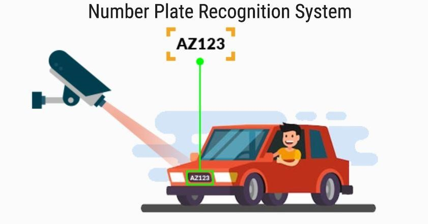
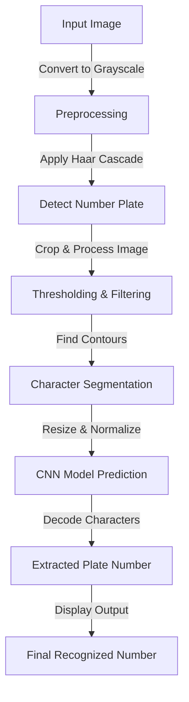
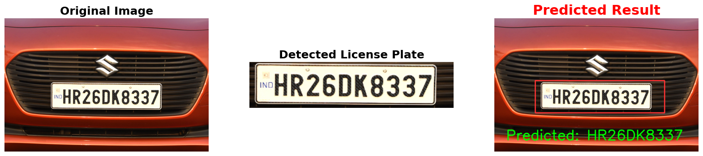

# Number Plate Recognition System ...🚗

## 📌 Overview
This project is a **Number Plate Recognition System** that utilizes **OpenCV, Keras, and TensorFlow** to detect, extract, and recognize vehicle license plates. The system first detects the number plate using **Haar Cascade Classifier**, processes the plate image, and then classifies individual characters using a **Convolutional Neural Network (CNN)**.

<p align="center">
  
</p>


## 🛠 Technologies Used
- **Python**
- **OpenCV** (for image processing and plate detection)
- **Keras & TensorFlow** (for building and training the CNN model)
- **NumPy & Pandas** (for data handling)
- **Matplotlib** (for visualization)
- **scikit-learn** (for model evaluation)

## 📊 Dataset
The dataset used for training the **Number Plate Recognition System** consists of individual character images. 

- **Character Dataset**:  
   - Contains individual characters (A-Z, 0-9) extracted from number plates.  
   - Each character is stored as a grayscale image of size **28x28 pixels**.  
   - Used for training the **CNN model** to recognize letters and digits.


## 📂 Project Structure
```
📦 Number-Plate-Recognition-System
├── 📁 data
│   ├── 📁 train          # Training dataset
│   └── 📁 val            # Validation dataset
├── 📁 models             # Contains trained models
├── 📁 haarcascades       # Haar cascade files for plate detection
├── 📄 Number_Plate_Recognition.ipynb   # Main detection script
├── 📄 trained_model.h5   # Saved trained model
├── 📄 test.ipynb         # Testing script
└── 📄 README.md          # Project documentation 

```

## 🔄 Workflow
1. **Load Image & Preprocess**
   - Read the image using OpenCV.
   - Convert it to grayscale.
   - Apply Haar Cascade to detect the number plate.
   - Crop and preprocess the detected plate.

2. **Character Segmentation**
   - Apply thresholding, erosion, and dilation to clean the image.
   - Find contours of characters.
   - Extract individual character images.

3. **Character Recognition**
   - Resize characters to 28x28.
   - Feed them into a trained CNN model.
   - Predict and decode the characters into a readable format.

4. **Model Training**
   - CNN architecture with Conv2D, MaxPooling, Dropout, and Dense layers.
   - Uses categorical cross-entropy loss and Adam optimizer.
   - Trained using **ImageDataGenerator** for data augmentation.

5. **Evaluation & Performance Metrics**
   - Evaluate accuracy using a validation dataset.
   - Display confusion matrix and classification report.

## 📊 Flowchart


## 🚀 How to Run
1. Clone the repository:
   ```bash
   git clone https://github.com/Shubham-Singla259/Number-Plate-Recognition-System.git
   cd Number-Plate-Recognition-System
   ```
2. Install dependencies:
   ```bash
   pip install -r requirements.txt
   ```
3. Run the detection script:
   ```bash
   python Number_Plate_Recognition.ipynb
   ```

## 📈 Results
- Achieved **high accuracy** using CNN model.
- Successfully detects and recognizes Indian number plates.
- Robust against different lighting conditions and angles.




The model achieved **97.69% accuracy**. Future improvements could include training with a larger dataset, improving character segmentation, and fine-tuning the model architecture for better generalization.


## 🏆 Future Improvements
- Improve OCR accuracy using advanced deep learning models.
- Add real-time detection using live camera feed.
- Support for multiple languages and number plate formats.

## 🏆 Future Uses and Applications

1. **Real-time Traffic Management**
   - Implementing the system with live traffic cameras to automatically capture and analyze vehicles, helping authorities monitor traffic flow, issue tickets, or identify stolen vehicles in real-time.

2. **Parking Lot Management**
   - Using the system in parking lots to track vehicle entries and exits, automatically record the time a vehicle enters or exits, calculate parking fees, or detect unauthorized vehicles.

3. **Toll Collection Systems**
   - Automating toll collection by recognizing vehicles passing through toll booths, enabling automatic fee deduction from registered accounts.

4. **Law Enforcement and Crime Prevention**
   - Enhancing law enforcement capabilities by recognizing vehicles involved in criminal activities, such as stolen cars or those that match descriptions from surveillance footage.

5. **Vehicle Fleet Management**
   - Assisting companies in managing their fleets of vehicles by automatically tracking their locations, ensuring proper use, maintenance, and compliance with speed limits.

---

## 🤝 Contributing
Feel free to fork the repo, raise issues, or contribute by adding new features!

---
✉️ **Contact:**  
[Shubham Singla (GitHub)](https://github.com/Shubham-Singla259)  
[Shubham Singla (LinkedIn)](https://www.linkedin.com/in/shubham-singla-b19003256/)


